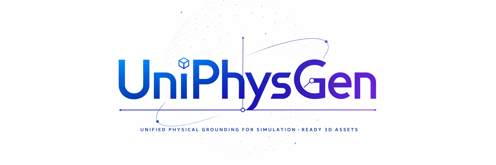
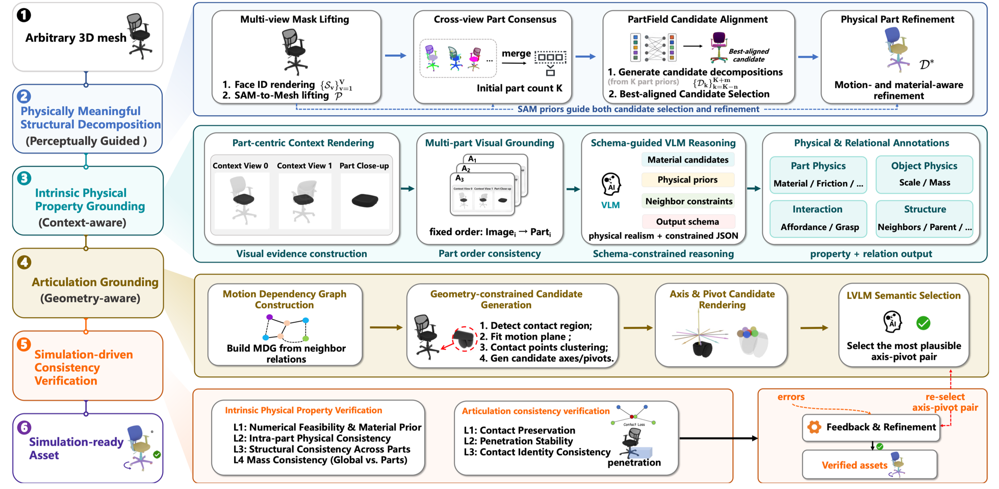
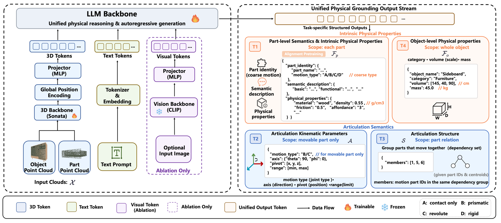

<!-- markdownlint-disable MD013 MD033 MD041 -->

# <a id="top"></a>UniPhysGen



<hr style="margin-top: 0; margin-bottom: 8px;">

<div align="center" style="margin-top: 0; padding-top: 0; line-height: 1;">
  <a href="https://arxiv.org/abs/2607.13586"></a>
  <a href="https://github.com/breezexian/UniPhysGen"></a>
  <a href="https://github.com/breezexian/UniPhysGen"></a>
  <a href="https://huggingface.co/collections/breezexian/uniphysgen"></a>
  <a href="https://huggingface.co/datasets/spatialverse/UniPhys-Bench"></a>
  <a href="./LICENSE"></a>
</div>

<h3 align="center">Unified Physical Grounding for Simulation-Ready 3D Assets</h3>

<p align="center">
  <a href="#news"><b>News</b></a> |
  <a href="#introduction"><b>Introduction</b></a> |
  <a href="#components"><b>Components</b></a> |
  <a href="#models"><b>Models</b></a> |
  <a href="#datasets"><b>Datasets</b></a> |
  <a href="#quick-start"><b>Quick Start</b></a> |
  <a href="#results"><b>Results</b></a> |
  <a href="#citation"><b>Citation</b></a> |
  <a href="#acknowledgements"><b>Acknowledgements</b></a> |
  <a href="#license"><b>License</b></a>
</p>

---

## <a id="news"></a>📢 News

- **September 3, 2026:** The UniPhys-Bench dataset has been released: [primary release](https://huggingface.co/datasets/spatialverse/UniPhys-Bench) and [Part 2](https://huggingface.co/datasets/breezexian/UniPhys-Bench-Part2).
- **September 3, 2026:** The UniPhys-40K dataset has been released. Download [here](https://huggingface.co/datasets/breezexian/UniPhys-40K).
- **August 30, 2026:** The UniPhysGen model weights have been released. Download [here](https://huggingface.co/collections/breezexian/uniphysgen).
- **August 30, 2026:** The source code for UniPhysGen and the UniPhys Pipeline has been released.
- **July 2026:** The UniPhysGen paper was released on [arXiv](https://arxiv.org/abs/2607.13586).

### Open-Source Release Roadmap

- [x] Release the UniPhysGen and UniPhys Pipeline source code.
- [x] Release the UniPhysGen model weights.
- [x] Release the UniPhys-Bench dataset.
- [x] Release the UniPhys-40K dataset.

---

## <a id="introduction"></a>💡 Introduction

**UniPhysGen** is a unified physical grounding model designed to process segmented 3D objects with heterogeneous part decompositions and generate structured physical semantics for simulation-ready assets. These outputs include part-level physical semantics and intrinsic properties, articulation kinematics and structure, and object-level scale and mass. Unlike previous methods that treat articulation and physical properties independently or rely on canonical part decompositions, UniPhysGen jointly reasons over both under diverse object structures. Together with **UniPhys Pipeline**, which transforms raw meshes into decomposed and simulation-verified assets, it bridges the gap between raw 3D assets and physically grounded representations for embodied AI, robotics, and simulation.

### 🏗️ UniPhys Pipeline: From Raw Meshes to Verified Assets



<p align="center"><em>The UniPhys Pipeline turns heterogeneous raw meshes into decomposed, physically grounded, articulated, and simulation-verified assets.</em></p>

### ✨ UniPhysGen: Unified Physical-Grounding Model



<p align="center"><em>UniPhysGen maps segmented 3D objects with heterogeneous part decompositions to structured physical semantics.</em></p>

---

## <a id="components"></a>🧩 Project Components

| Component | Role | Resource |
| --- | --- | --- |
| **UniPhys Pipeline** | Raw meshes → simulation-ready assets | [Pipeline README](./uniphys_pipeline/README.md) |
| **UniPhysGen** | Segmented 3D objects → unified physical semantics | [Model and training README](./uniphysgen/README.md) |
| **UniPhys-40K** | Large-scale training dataset | [Hugging Face](https://huggingface.co/datasets/breezexian/UniPhys-40K) |
| **UniPhys-Bench** | Human-verified evaluation benchmark | [Primary release](https://huggingface.co/datasets/spatialverse/UniPhys-Bench) · [Part 2](https://huggingface.co/datasets/breezexian/UniPhys-Bench-Part2) |

---

## <a id="models"></a>🧬 Model Zoo

| Checkpoint | Prediction target | Link |
| --- | --- | --- |
| **UniPhysGen-1.7B-Physics** | Part identity, semantic descriptions, and intrinsic physical properties | 🤗 [Hugging Face](https://huggingface.co/breezexian/UniPhysGen-1.7B-Physics) |
| **UniPhysGen-1.7B-Kinematics** | Joint type, axis, pivot, and motion range | 🤗 [Hugging Face](https://huggingface.co/breezexian/UniPhysGen-1.7B-Kinematics) |
| **UniPhysGen-1.7B-Structure** | Motion-coupled part group | 🤗 [Hugging Face](https://huggingface.co/breezexian/UniPhysGen-1.7B-Structure) |
| **UniPhysGen-1.7B-Object** | Object identity, category, dimensions, and mass | 🤗 [Hugging Face](https://huggingface.co/breezexian/UniPhysGen-1.7B-Object) |

[comment]: <> (The initialization checkpoint is a training dependency rather than a released task checkpoint. Its role and setup are described in the [UniPhysGen README]&#40;./uniphysgen/README.md&#41;.)

---

## <a id="datasets"></a>🗃️ Datasets

| Dataset | Scale | Purpose | Link |
| --- | --- | --- | --- |
| **UniPhys-40K** | 40K (40014) objects · 400K total parts · 370K filtered training parts | Large-scale training corpus with object- and part-level physical grounding annotations | 🤗 [Hugging Face](https://huggingface.co/datasets/breezexian/UniPhys-40K) |
| **UniPhys-Bench** | 1.9K (1927) objects across two releases · 16K parts · 5.5K motion-relevant components | Curated benchmark for unified physical-grounding evaluation and simulation-oriented inspection | 🤗 [Primary release](https://huggingface.co/datasets/spatialverse/UniPhys-Bench) (1,473 objects) · [Part 2](https://huggingface.co/datasets/breezexian/UniPhys-Bench-Part2) (454 objects) |

The Hugging Face dataset pages document directory layouts, annotation schemas, filtering fields, units, provenance, and usage notes.

> [!NOTE]
> **Simulation-ready URDF assets.** UniPhys-Bench provides URDF files with articulated joint parameters and real-world dimensions in meters. Physical properties are not preconfigured; users can assign them from the provided annotations as needed for their simulator or task.

---

## <a id="quick-start"></a>🚀 Quick Start

This page is intentionally concise. Choose the path that matches your input and task:

| Goal | Start here |
| --- | --- |
| Convert raw meshes into segmented and simulation-oriented assets | [UniPhys Pipeline README](./uniphys_pipeline/README.md) |
| Install UniPhysGen and run inference | [UniPhysGen README](./uniphysgen/README.md) |
| Use a task-specific checkpoint | [Model Zoo](#models) |
| Reproduce UniPhys-Bench evaluation | [UniPhysGen README](./uniphysgen/README.md) |
| Reproduce training or train on custom data | [UniPhysGen README](./uniphysgen/README.md) |

---

## <a id="results"></a>📊 Results and Demos

UniPhysGen achieves state-of-the-art performance across most articulation grounding and intrinsic physical property estimation settings on UniPhys-Bench, while remaining robust to heterogeneous part decompositions. The resulting physically grounded assets can be deployed in robotic simulation environments for realistic interaction. See the [paper](https://arxiv.org/abs/2607.13586) for complete quantitative results, qualitative comparisons, and simulation demos.

---

## <a id="citation"></a>📝 Citation

If UniPhysGen, UniPhys-40K, UniPhys-Bench, or the UniPhys Pipeline is useful in your research, please cite:

```bibtex
@article{li2026uniphysgen,
  title   = {UniPhysGen: Unified Physical Grounding for Simulation-Ready 3D Assets},
  author  = {Li, Xian and Wei, Rong and Yang, Lujie and Huang, Haolin and Fang, Junyuan and Tang, Siliang and Xiao, Jun and Tang, Rui and Li, Juncheng},
  journal = {arXiv preprint arXiv:2607.13586},
  year    = {2026}
}
```

---

## <a id="acknowledgements"></a>🙏 Acknowledgements

This project builds on ideas, code, models, datasets, and tools from the open-source 3D, vision, and language-model communities. We especially thank:

- [SpatialLM](https://github.com/manycore-research/SpatialLM), [LLaMA-Factory](https://github.com/hiyouga/LlamaFactory), [Qwen3](https://huggingface.co/Qwen/Qwen3-1.7B), and [Sonata](https://github.com/facebookresearch/sonata) for model and training foundations.
- [SAM 2](https://github.com/facebookresearch/sam2) and [PartField](https://github.com/nv-tlabs/PartField) for components used by the asset-processing workflow.
- [PhysX-3D](https://github.com/ziangcao0312/PhysX-3D) for related work and resources in 3D physical reasoning.
- [PartNet](https://github.com/daerduocarey/partnet_dataset), [ShapeNet](https://shapenet.org/), [Objaverse](https://objaverse.allenai.org/), [HSSD](https://3dlg-hcvc.github.io/hssd/), [3D-FUTURE](https://github.com/3D-FRONT-FUTURE/3D-FUTURE-ToolBox), and [Amazon Berkeley Objects](https://amazon-berkeley-objects.s3.amazonaws.com/index.html) for the source assets and annotations that support the UniPhys datasets, subject to their respective terms.
- Blender, MuJoCo, NVIDIA Isaac Sim, Open3D, and trimesh for the geometry-processing and simulation ecosystem.

Please consult the upstream projects and the repository notice files for full attribution and third-party license terms.

---

## <a id="license"></a>📜 License

- **Source code:** UniPhysGen and the UniPhys Pipeline are released under the Apache License 2.0. See the [UniPhysGen license](./uniphysgen/LICENSE.txt) and [pipeline license](./uniphys_pipeline/LICENSE).
- **Model weights:** Released UniPhysGen checkpoints are licensed under [CC BY-NC 4.0](https://creativecommons.org/licenses/by-nc/4.0/), as stated in their model cards.
- **Datasets:** UniPhys dataset annotations and redistributed assets remain subject to the terms stated in the corresponding dataset cards and the licenses of their original sources.
- **Third-party components:** External code, models, and assets retain their original licenses. See the [UniPhysGen NOTICE](./uniphysgen/NOTICE) and [pipeline third-party notices](./uniphys_pipeline/THIRD_PARTY_NOTICES.md).

#### 🔝 [Back to Top](#top)
